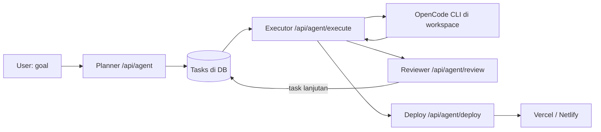

# 🤖 CPAgents

**CPAgents** adalah web app AI agent otonom yang bisa memecah sebuah goal menjadi task-task, mengeksekusinya secara nyata (bikin file, jalanin command) lewat [OpenCode](https://opencode.ai), mengevaluasi hasilnya, mengulang (looping) sampai selesai, lalu **men-deploy hasilnya sendiri** ke Vercel/Netlify.

Semua berjalan lewat gateway yang OpenAI-compatible, jadi kamu bisa pakai model apa pun (Claude, GPT, Grok, dll) via satu baseURL.

---

## ✨ Fitur

- **🧠 Planner → Executor → Reviewer loop** — goal dipecah jadi sejumlah task sesuai kompleksitas (bisa sedikit atau banyak), dieksekusi satu per satu, lalu direview otomatis untuk menambah task lanjutan sampai tuntas.
- **⚙️ Eksekusi nyata via OpenCode** — bukan sekadar teks; agent benar-benar membuat & mengubah file dan menjalankan command di workspace terisolasi per project.
- **📡 Log real-time** — output OpenCode di-stream langsung ke UI (via SSE + PTY), jadi kamu lihat progres tanpa nunggu diam.
- **📂 File browser** — jelajahi & lihat isi file setiap project langsung dari UI, seperti explorer.
- **🚀 Self-deploy** — publish project ke **Vercel** / **Netlify** otomatis atau lewat satu tombol, lengkap dengan input nama web custom (`nama-web.vercel.app`).
- **🗂️ Manajemen project** — daftar project, pindah workspace, lanjutkan task/looping, dengan progress bar & status badge (Berjalan / Selesai / Ada yang gagal).
- **❌ Status task jujur** — kalau eksekusi gagal (exit code ≠ 0), ditandai **FAILED** dengan tombol mulai ulang, bukan fake "sukses".
- **💾 Settings persisten** — baseURL, API key (tersensor di UI), model, dan token deploy tersimpan di DB; otomatis ter-load tiap buka web.
- **🔁 Anti rate-limit** — auto-retry dengan backoff saat gateway kena 429/5xx.
- **🎯 Token budget 150k** — prompt dibangun bertahap dengan estimasi token supaya tidak langsung membengkak.

---

## 🏗️ Arsitektur



- **Planner** memecah goal menjadi task.
- **Executor** menjalankan OpenCode untuk tiap task di `workspaces/<sessionId>`.
- **Reviewer** mengevaluasi hasil dan menambah task recovery/lanjutan.
- **Deploy** mem-publish project ke Vercel/Netlify (token di-inject sebagai env var, tidak pernah ter-print).

---

## 🛠️ Tech Stack

- **Next.js 14** (App Router, JavaScript)
- **Prisma 7** + **SQLite** (`@prisma/adapter-better-sqlite3`)
- **OpenCode CLI** untuk eksekusi agent
- **Server-Sent Events (SSE)** untuk streaming log
- Gateway **OpenAI-compatible** (model apa pun via baseURL)

---

## 🚀 Menjalankan Secara Lokal

### 1. Prasyarat
- Node.js 18+
- [OpenCode CLI](https://opencode.ai) terinstall (`opencode` ada di PATH, atau set `OPENCODE_BIN`)
- Gateway/endpoint OpenAI-compatible + API key

### 2. Install & setup

```bash
git clone https://github.com/yusuffadllh/CPAgents.git
cd CPAgents
npm install
```

Buat file `.env`:

```env
DATABASE_URL="file:./dev.db"
# Opsional: path ke binary opencode kalau tidak di PATH
OPENCODE_BIN=/path/to/opencode
```

Siapkan database:

```bash
npx prisma db push
```

### 3. Jalankan

```bash
npm run dev
```

Buka [http://localhost:3005](http://localhost:3005).

### 4. Konfigurasi
Klik **Settings** dan isi:
- **Base URL** — endpoint gateway OpenAI-compatible (mis. `http://host:port/v1`)
- **API Key**
- **Model** — mis. `provider/model-name`
- **(Opsional) Vercel / Netlify Token** — untuk fitur self-deploy

Semua tersimpan otomatis, tidak perlu diisi ulang tiap buka web.

---

## 🚀 Self-Deploy

CPAgents bisa mem-publish project yang dibuatnya sendiri:

1. Isi **Vercel Token** (dari [vercel.com/account/tokens](https://vercel.com/account/tokens)) atau **Netlify Token** di Settings.
2. Pilih sebuah project, (opsional) ketik **nama web** di kolom deploy.
3. Klik **🚀 Deploy** — atau tulis goal yang mengandung kata "deploy/online/publish" agar planner menambah task deploy otomatis.
4. URL live (`https://nama-web.vercel.app`) muncul di log setelah selesai.

Token di-inject sebagai environment variable, jadi model tidak pernah melihat atau mencetak nilainya.
Token Vercel/Netlify hanya dikirim ke proses agent pada task deploy; task biasa jalan tanpa kredensial itu.

### GitHub Token — pakai **Fine-grained**

Settings → **GitHub Token**. Buat di
[github.com/settings/personal-access-tokens](https://github.com/settings/personal-access-tokens):

- **Repository access:** Only select repositories → pilih repo yang dipakai (jangan "All repositories").
- **Permissions → Repository permissions → Contents: Read and write.** Hanya ini yang wajib.
  (Tambah **Workflows: Read and write** hanya jika agent perlu mengubah file di `.github/workflows/`.)
- **Expiration:** pilih yang pendek, mis. 30–90 hari.

`Contents: write` cukup karena agent **tidak pernah membuat repo** — `git push` selalu ke remote yang
sudah ada, dan prompt melarang model mengarang URL repo (lihat `lib/deploy-rules.js`). Jadi bikin dulu
repo-nya di GitHub, lalu isi field **GitHub Repo URL** di UI.

Kalau Anda memang ingin repo dibuat via API (`POST /user/repos`), permission-nya bukan Contents
melainkan **Administration: Read and write** — dan karena repo-nya belum ada, token harus di-scope ke
**All repositories**. Itu jauh lebih luas, jadi lebih baik buat repo manual sekali saja.

Classic PAT juga jalan, tapi scope `repo` memberi akses tulis ke **semua** repo Anda — hindari.

**Mode deploy** (Settings → Deploy Mode):
- `cli` — agent menjalankan `vercel deploy` sendiri.
- `git` — deploy = `git push`; platform build otomatis. Di mode ini token Vercel/Netlify **tidak**
  diberikan ke agent sama sekali, supaya satu commit tidak ter-deploy dua kali.

Token disimpan di tabel `Settings` pada `dev.db` dalam bentuk **plaintext**, dan saat runtime ditulis ke
`workspaces/.opencode-home-<nama>/.git-credentials` (mode `600`, di luar folder project sehingga tidak
ikut commit atau ZIP export). Jadi jaga akses server dan `dev.db`, dan revoke token bila bocor.

---

## 📦 Deploy CPAgents ke Server (PM2)

```bash
pkill -9 -f "opencode run"
cd ~/CPAgents
cp dev.db "dev.db.bak-$(date +%Y%m%d-%H%M%S)"   # db push bisa ubah tabel
git remote set-url origin https://github.com/yusuffadllh/CPAgents.git
git pull
npm ci                    # dependency dokumen baru (pdfkit, exceljs, docx, pptxgenjs)
npx prisma db push        # WAJIB rilis ini: kolom githubToken/deployMode dsb.
npm run build
pm2 restart ai-chat --update-env   # ganti "ai-chat" dengan nama PM2 app-mu
pm2 logs ai-chat
```

Backup `dev.db.bak-*` diabaikan git (lihat `.gitignore`), jadi aman ditinggal di server.

---

## 📁 Struktur Singkat

```
app/
  api/agent/            # planner, executor, review, deploy, files, retry
  api/chat|settings|export
  components/           # Sidebar, SettingsModal, FileBrowser
  page.js               # UI utama agent
lib/
  opencode.js           # spawn OpenCode (PTY, env, config)
  context.js            # token budget, goal cleaner, retry gateway
  prisma.js
prisma/schema.prisma
workspaces/<sessionId>/ # folder kerja tiap project (dibuat saat runtime)
```

---

## 📝 Catatan

- Setiap project punya **workspace terisolasi** di `workspaces/<sessionId>`.
- Menghapus history di UI hanya menghapus record di DB — **file project di disk tetap aman**.
- Deploy yang sudah live tidak terpengaruh saat history dihapus.
